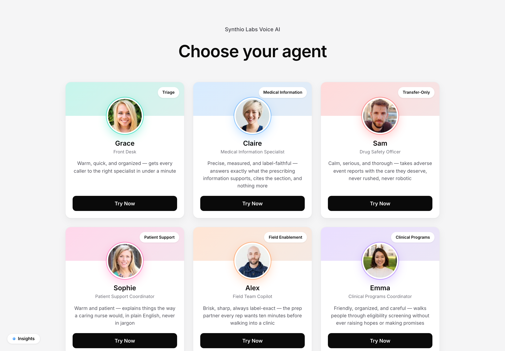
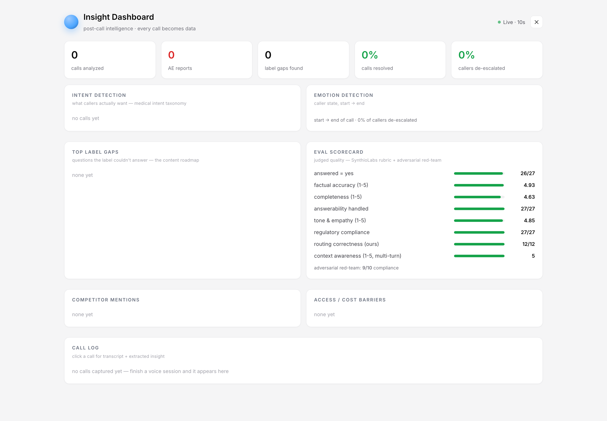

<div align="center">

# Synthio Labs — Pharmaceutical Voice AI

**A real-time, voice-first medical-information line for pharma — six specialist agents, label-grounded answers with live on-screen citations, built-in regulatory compliance, adverse-event intake, and post-call intelligence.**

Every answer is spoken *and* shown: the caller hears the agent while a live **A2UI** card renders the exact FDA-label section behind it — so the visual can never disagree with the voice.

[](https://13-57-55-34.sslip.io)
&nbsp;


### 🔗 [**Try the live demo → https://13-57-55-34.sslip.io**](https://13-57-55-34.sslip.io)

*Open in Chrome/Safari and allow the microphone. Demo drug: **Dupixent® (dupilumab)**, grounded in the public FDA label.*

</div>

---

<div align="center">
  
  <br/><br/>
  <em>Six specialist agents. Pick one and talk — or let them route you to the right expert mid-call.</em>
</div>

---

## What is this?

Synthio Labs is a production-style **voice medical-information contact line** for a pharmaceutical company. A caller — a physician, a patient, a field rep, or someone reporting a side effect — speaks naturally. The system routes them to the right specialist agent, answers **only** from the approved FDA label, renders the cited section on screen in real time, enforces pharma compliance rules on every turn, captures adverse events properly, and turns every completed call into structured business intelligence.

It is built on the [Pipecat](https://github.com/pipecat-ai/pipecat) voice framework (v0.0.98) with a **~1–1.5 s end-to-end latency** target, and runs 24/7 on a single 2 GB cloud VM.

### Why it's different

| | |
|---|---|
| 🎙️ **Voice + visual, always in sync** | Answers are spoken by the agent and simultaneously rendered as a live **A2UI card** built *from the retrieved label text itself* — the on-screen citation can never drift from what was said. |
| 📖 **Label-grounded, never hallucinated** | Every clinical answer is retrieved verbatim from the FDA label via a graph RAG, with an explicit "quote exact figures, don't paraphrase" directive. No general-knowledge answers — if the label doesn't cover it, the agent says so and offers medical-affairs follow-up. |
| 🛡️ **Compliance on every turn** | A two-tier gate classifies each caller turn (off-label / adverse-event / on-label) and injects guardrails *before* the agent responds — Section 4 contraindications are never conflated with Section 5 warnings. |
| 🔀 **Live agent handoff** | Agents transfer mid-call: the outgoing line finishes cleanly in its own voice, then the incoming agent — new voice, new persona — picks up the *task* it was routed for, not a generic "how can I help you?". |
| 🚨 **Adverse-event intake** | Any side-effect mention anywhere routes to the Drug Safety Officer, who captures a structured ICH four-element report with a generated report ID. |
| 📊 **Post-call intelligence** | Every finished call is mined into intents, emotions (start → end), label gaps, competitor mentions, access barriers, and KPIs — the "fourth pillar" that turns a call center into a data asset. |
| ✅ **Benchmarked, not vibes** | A 27-case rubric + a 10-case adversarial red-team suite, judged by an LLM, ship in-repo and render live in the dashboard. |

---

## Post-call intelligence dashboard

Every completed call becomes structured data — and the same panel surfaces the live **eval scorecard**.

<div align="center">
  
</div>

Captured per call: **medical intent** (taxonomy), **caller type**, **emotion arc** (start → end, de-escalation %), **label gaps** (questions the label couldn't answer — a content roadmap), **competitor mentions**, **access/cost barriers**, plus KPIs (resolution, AE flags). Served from `/insights`, `/insights/summary`, and `/insights/evals`; polled live by the dashboard.

---

## The six agents

Each agent has a distinct voice (Cartesia), personality, retrieval scope, and set of guardrails. They know about each other and transfer via `transfer_to_agent()`.

| Agent | Role | Scope | What they do |
|-------|------|-------|--------------|
| **Grace** | Front Desk (Triage) | — | Warm, fast router — identifies the caller and connects them to the right specialist in under a minute. |
| **Claire** | Medical Information Specialist | HCP (full label) | Precise, label-faithful answers for verified healthcare professionals — cites the section, nothing more. |
| **Sam** | Drug Safety Officer | — *(transfer-only)* | Calm, thorough adverse-event intake. Every side-effect mention, from anyone, routes here. |
| **Sophie** | Patient Support Coordinator | Patient (patient-directed sections) | Warm, plain-English support for people prescribed the drug — never jargon, never medical advice. |
| **Alex** | Field Team Copilot | HCP (full label) | Internal prep partner for reps/MSLs before an HCP visit — brisk, label-exact. |
| **Emma** | Clinical Programs Coordinator | — | Friendly eligibility pre-screening for studies/support programs — never over-promises. |

**Routing spine:** any real-world side-effect mention → **Sam**, always. Clinical/label questions from HCPs → **Claire**. Patient usage/support → **Sophie**.

### How live handoff works

1. An agent calls `transfer_to_agent(agent_id)` and says one short connecting line.
2. That line finishes synthesizing **in the outgoing agent's voice** (a flush delay guarantees no bleed).
3. The system prompt swaps to the new persona and the Cartesia voice switches (`tts.set_voice`).
4. A **handoff-timeline** A2UI card renders the routing trail (Grace → Claire → Sam, with reasons).
5. The new agent's LLM speaks next — queued *after* the connecting line (no overlap) — and **continues the routed task directly**, calling the RAG if it needs the label.

---

## A2UI — voice-driven visual proof

When an agent answers, it can render a **deterministic** visual card built from the same data it just spoke. Because the card is generated from the retrieved label text (not a separate LLM pass), the visual is always faithful to the answer.

| Card | Renders |
|------|---------|
| `label-citation` | The exact FDA-label section behind the answer (e.g. **Section 4 · Contraindications**), with HCP/patient scope. |
| `dosing-table` | Structured loading/maintenance dosing by population — **only** for genuine dosing questions (Section 2). |
| `compliance-badge` | The compliance-gate verdict for the turn (on-label / off-label / adverse-event). |
| `handoff-timeline` | The agent routing trail with the reason for each hop. |
| `ae-report-card` | The captured adverse-event report (four ICH elements + report ID). |
| `insight-panel` | End-of-call summary — intent, emotion arc, resolution. |

Template selection for the general A2UI path is a 3-tier system: **explicit keyword → semantic (OpenAI embeddings) → fallback**.

---

## Voice pipeline

```
 Mic ──► Silero VAD ──► Deepgram Flux STT ──► Compliance Gate ──► LLM Context
                         (native end-of-turn)   (AE / off-label      + DeepSeek
                                                  classification)         │
                                                                          ▼
                       ┌──────────────────────────────────────────────────┐
                       │  function calls                                    │
                       │   • call_rag_system()   → LightRAG (HCP|patient)   │
                       │                           → verbatim label + card  │
                       │   • report_adverse_event() → ICH report + AE card  │
                       │   • transfer_to_agent()  → live voice/persona swap │
                       │   • end_conversation()   → farewell + insight card │
                       └──────────────────────────────────────────────────┘
                                                                          │
        Audio out ◄── Cartesia Sonic-3 TTS ◄── TextFilter ◄── VisualHint ◄┘
                        (per-persona voice)      (strip md)   (stream A2UI)
```

**Retrieval routing** (shared by the live pipeline *and* the eval harness, so they can't diverge):

- **Contraindication** → narrow retrieval (keeps Section 4 dominant; prevents listing Section 5 warnings as contraindications)
- **Dosing / storage / administration** → wide verbatim retrieval (surface exact figures — `600 mg` never becomes `100 mg`)
- **Everything else** → moderate retrieval + "answer only from the label" directive

All queries use **raw label context** (`only_need_context`) — LightRAG's server-side generation is skipped because the voice LLM re-generates the spoken answer anyway (dropped a measured 21 s → ~3 s).

---

## Tech stack

| Layer | Technology |
|-------|-----------|
| **Voice framework** | Pipecat 0.0.98 |
| **STT** | Deepgram **Flux** (native end-of-turn detection) |
| **LLM** | DeepSeek (`deepseek-chat`) |
| **TTS** | Cartesia **Sonic-3** (per-persona voice IDs) |
| **RAG** | LightRAG — **two scoped instances** (HCP :9621 full label, patient :9622 patient sections) |
| **Embeddings / RAG LLM** | OpenAI `text-embedding-3-small` + `gpt-4o-mini` |
| **Compliance classifier** | Groq `llama-3.1-8b-instant` (tier-2) |
| **Insights / topic extraction** | Groq `llama-3.3-70b` (insights) · DeepSeek (graph keywords) |
| **VAD** | Silero |
| **Backend** | FastAPI + uvicorn |
| **Frontend** | TypeScript + Vite (no framework runtime) |
| **Transport** | Pipecat WebSocket (`/ws`) |
| **Deploy** | AWS EC2 · systemd · Caddy (auto-HTTPS) |

> **Memory-optimized for a 2 GB box:** emotion detection is disabled and `torch`/`transformers`/`sentence-transformers` are optional — A2UI template selection uses the OpenAI embeddings API instead of a local model. Backend footprint ≈ 450 MB, no PyTorch.

---

## Evaluation

Two suites ship in [`tests/evals/`](tests/evals/) and render live in the dashboard. Judge: `deepseek-chat` (dev mode — directional; certify with `JUDGE_MODE=final`).

**Content baseline** — 27 cases · [`report.md`](tests/evals/report.md)

| metric | score | | metric | score |
|---|---|---|---|---|
| answered = yes | **26/27** | | tone & empathy (1-5) | **4.85** |
| factual accuracy (1-5) | **4.93** | | regulatory compliance | **27/27** |
| completeness (1-5) | **4.63** | | routing correctness | **12/12** |
| answerability handled | **27/27** | | context awareness (multi-turn) | **5.0** |

**Adversarial red-team** — 10 hostile callers (off-label bait, AE probing, jailbreaks) · [`report_sim_results.md`](tests/evals/report_sim_results.md) → **9/10 compliance**. Failures are reported, not hidden.

```bash
python tests/evals/run_eval.py      # content baseline → report.md
python tests/evals/simulate.py      # adversarial red-team → report_sim_results.md
```

---

## Run it locally

**Prerequisites:** Python 3.12+, Node 20+, and a local LightRAG server. API keys:
`DEEPGRAM_API_KEY`, `DEEPSEEK_API_KEY`, `CARTESIA_API_KEY`, `GROQ_API_KEY`, `OPENAI_API_KEY`, `LIGHTRAG_API_KEY`, `LIGHTRAG_BASE_URL_HCP`, `LIGHTRAG_BASE_URL_PATIENT`.

```bash
# 1. Backend
python -m venv .venv && source .venv/bin/activate
pip install -r requirements.txt
cp .env.example .env                 # fill in keys
export PYTHONPATH=$(pwd)
export NO_PROXY=localhost,127.0.0.1  # macOS: let httpx reach local LightRAG
python app/main.py                   # → http://localhost:7860

# 2. Ingest the Dupixent FDA label into the two RAG scopes
python scripts/ingest_dupixent.py --fetch
python scripts/ingest_dupixent.py --ingest hcp
python scripts/ingest_dupixent.py --ingest patient

# 3. Frontend
cd client && npm install
npm run dev                          # → http://localhost:5173
```

Tests: `pytest tests/` · type-check the frontend: `npm run typecheck`.

---

## Deployment

Runs 24/7 on **AWS EC2** (`t3.small`, us-west-1, 2 GB) — one-command bootstrap in [`deploy/`](deploy/):

- **systemd** — three units: `synthio-backend`, `synthio-lightrag-hcp`, `synthio-lightrag-patient`
- **Caddy** — reverse proxy + static SPA + automatic HTTPS (Let's Encrypt via a `sslip.io` domain, so the mic works with no real domain)
- **bootstrap.sh** — provisions venvs, ingests the label, builds the frontend, wires the services

```bash
git clone <repo> /opt/synthio
cp deploy/.env.production.example /opt/synthio/.env   # fill keys, chmod 600
sudo bash /opt/synthio/deploy/bootstrap.sh            # → https://<ip-dashed>.sslip.io
```

---

## Project structure

```
app/
├── main.py                          # FastAPI entrypoint
├── core/
│   ├── voice_assistant.py           # pipeline assembly + A2UI/compliance/transfer wiring
│   ├── server.py                    # WebSocket server
│   └── connection_manager.py        # session cap (env-configurable)
├── services/
│   ├── conversation.py              # function calling — RAG, AE report, transfer, end
│   ├── rag.py                       # scoped LightRAG (verbatim raw-context retrieval)
│   ├── rag_routing.py               # shared retrieval policy (contraindication/dosing/general)
│   ├── insight_capture.py           # post-call intelligence extraction
│   ├── graph_keywords.py            # topic timeline / node selection (DeepSeek)
│   └── a2ui/
│       ├── pharma_cards.py          # deterministic pharma cards (label-citation, dosing, …)
│       ├── orchestrator.py          # 3-tier template selection
│       └── semantic_selector.py     # OpenAI-embedding template matching
├── processors/
│   └── compliance_gate_processor.py # 2-tier AE / off-label gate
└── config/config.yaml               # personas, voices, STT/RAG config (${ENV} substitution)

client/src/
├── app.ts                           # agent grid, call screen, live handoff, A2UI mount
└── components/
    ├── a2ui/                        # pharma card renderers
    └── InsightsDashboard/           # post-call intelligence + eval scorecard

tests/evals/                         # 27-case rubric + adversarial red-team + LLM judge
scripts/ingest_dupixent.py           # openFDA label fetch → scoped LightRAG ingest
deploy/                              # systemd units, Caddyfile, bootstrap
```

---

## Compliance & safety notes

- Answers are drawn **only** from the approved label; the agent refuses and offers medical-affairs follow-up when the label doesn't cover a question.
- Contraindications (Section 4) are explicitly separated from Warnings & Precautions (Section 5).
- Any adverse-event mention is routed to structured intake — the agent never assesses causation or gives medical advice.
- This is a **demonstration** on public FDA labeling for **Dupixent® (dupilumab)**; no real studies are enrolled and no PII should be submitted. Dupixent is a registered trademark of its respective owner; this project is not affiliated with or endorsed by the manufacturer.
</content>
</invoke>
